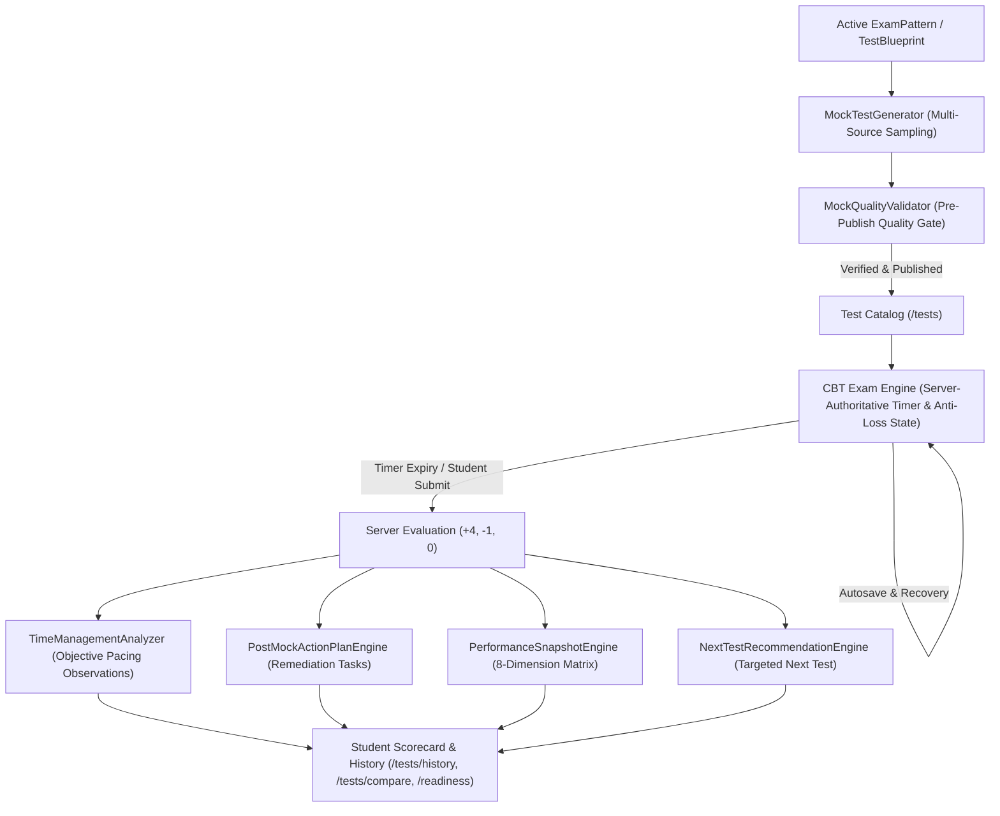
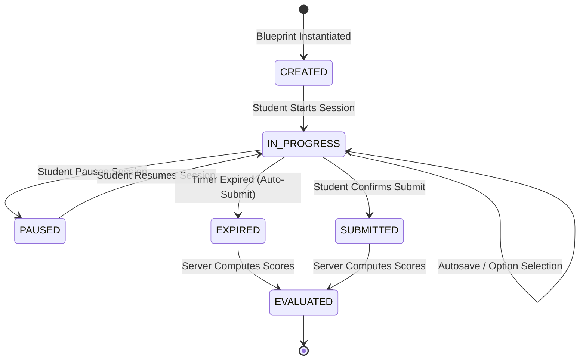

# PHASE 5 FINAL AUDIT REPORT: NEET EXAM SIMULATION & ADVANCED PERFORMANCE ENGINE

**Platform:** NEET UG 2027 Preparation Web Platform  
**Target Examination:** NEET (UG) 2027  
**Module:** Phase 5 Exam Simulation & Advanced Performance Engine  
**Verification Date:** September 30, 2026  
**Build Status:** Production Build Successful (`next build` — Exit Code 0)  
**Acceptance Test Verdict:** 37/37 Tests Passed (100% Pass Rate)  
**Regression Suites:** Phase 4 (35/35), Phase 3 (28/28), Phase 2 (29/29) All Passed  

---

## 1. Executive Summary

Phase 5 establishes the **NEET Exam Simulation & Advanced Performance Engine**, elevating the platform from personalized practice into an authoritative, full-scale exam simulation environment. The system models the canonical NEET UG examination lifecycle from blueprint definition to post-mock educational remediation.

The engine enforces five architectural guarantees:
1. **Configurable Exam Patterns**: The exam format is managed as a database configuration entity (`ExamPattern`), enabling administrator-level updates without codebase rewrites.
2. **Server-Authoritative Runtime Security**: Exam timing is calculated and enforced on the server (`expiresAt = startedAt + duration`), preventing client timer tampering, network clock manipulation, or extended response windows.
3. **Pre-Publish Quality Gate**: Zero unverified, unpublished, duplicate, or malformed questions can enter an active exam session.
4. **8-Dimension Neutral Readiness Matrix**: Student readiness is never collapsed into an arbitrary fake score. Instead, 8 independent operational competencies are evaluated against official medical college admission benchmarks.
5. **Continuous Closed-Loop Learning**: Completed tests immediately trigger time management pacing observations, post-mock action plans, spaced revision schedules, and personalized next-test recommendations.



---

## 2. Exam Pattern Configuration System

NEET examination formats evolve over time. To avoid hardcoded exam structures, Phase 5 introduces the `ExamPattern` model.

### 2.1 Database Schema
```prisma
model ExamPattern {
  id                   String          @id @default(cuid())
  examName             String          // "NEET UG 2027"
  examYear             Int             // 2027
  durationMinutes      Int             // 200
  totalQuestions       Int             // 200
  totalMarks           Float           // 720.0
  positiveMarks        Float           // 4.0
  negativeMarks        Float           // 1.0
  subjectConfiguration String          // JSON: { "BIOLOGY": 100, "PHYSICS": 50, "CHEMISTRY": 50 }
  sectionConfiguration String?         // JSON: { "SectionA": 35, "SectionB": 15, "maxSectionB": 10 }
  instructions         String?         // Official CBT instructions in Markdown
  active               Boolean         @default(false)
  createdAt            DateTime        @default(now())
  updatedAt            DateTime        @updatedAt
  blueprints           TestBlueprint[]
  tests                Test[]
}
```

### 2.2 Canonical NEET UG 2027 Active Configuration
- **Duration**: 200 minutes (3 hours 20 minutes)
- **Total Questions**: 200 questions across Section A (35 mandatory per subject) and Section B (15 optional, attempt 10 per subject)
- **Attempt Target**: 180 questions attempted
- **Total Marks**: 720 Marks (+4 for correct, -1 for incorrect, 0 for unattempted)
- **Subject Weights**:
  * Biology: 100 Questions (Botany: 50, Zoology: 50)
  * Physics: 50 Questions
  * Chemistry: 50 Questions

---

## 3. Mock Test Blueprint Architecture

Blueprints guarantee mathematical auditability and deterministic reproducibility across test generations.

### 3.1 Model Schema
```prisma
model TestBlueprint {
  id                     String       @id @default(cuid())
  title                  String
  examPatternId          String?
  examPattern            ExamPattern? @relation(fields: [examPatternId], references: [id])
  targetCount            Int
  subjectDistribution    String       // JSON: { "BIOLOGY": 100, "PHYSICS": 50, "CHEMISTRY": 50 }
  domainDistribution     String?      // JSON: Botany/Zoology/Organic/Inorganic/Mechanics
  difficultyDistribution String?      // JSON: { "EASY": 0.40, "MEDIUM": 0.45, "HARD": 0.15 }
  sourceDistribution     String?      // JSON: { "PYQ": 0.40, "NCERT": 0.35, "FINGERTIPS": 0.25 }
  rulesJson              String?      // Rules: allowDuplicates=false, requireVerified=true
  createdAt              DateTime     @default(now())
  updatedAt              DateTime     @updatedAt
  tests                  Test[]
}
```

### 3.2 Mathematical Validation Rules
Before any blueprint is persisted, `MockBlueprintEngine.validateBlueprint` enforces:
1. $\sum \text{SubjectQuestions} = \text{TargetCount}$
2. $\sum \text{DifficultyRatios} = 1.0 \pm 0.05$ (or $100\% \pm 2\%$)
3. $\sum \text{SourceRatios} = 1.0 \pm 0.05$ (or $100\% \pm 2\%$)
4. $\text{rules.requireVerified} = \text{true}$ (hard invariant)

---

## 4. Test Generator Engine (`MockTestGenerator`)

The `MockTestGenerator` orchestrates multi-source question selection across canonical NCERT exercises, verified PYQs, and MTG Fingertips items.

### 4.1 Generation Workflow
1. **Pattern Resolution**: Loads the active `ExamPattern` configuration.
2. **Blueprint Construction**: Creates or attaches a validated `TestBlueprint`.
3. **Sampling Strategy**:
   - Excludes duplicate copies (`duplicateOfId: null`).
   - Filters exclusively `verificationStatus = 'VERIFIED'` and `publicationStatus = 'PUBLISHED'`.
   - Organizes questions into official Section A and Section B groups.
4. **Auditable Snapshot**: Embeds `blueprintJson` directly onto the `Test` record for historical reproducibility.

---

## 5. Quality Gate & Pre-Publish Validation (`MockQualityValidator`)

Before any test can transition to `isPublished: true`, it must clear the quality gate:

| Dimension | Rule | Severity |
|---|---|---|
| Question Count | `test.testQuestions.length === test.totalQuestions` | Critical Error |
| Unverified Exclusion | $100\%$ questions must be `VERIFIED` | Critical Error |
| Unpublished Exclusion | $100\%$ questions must be `PUBLISHED` | Critical Error |
| Deduplication | Zero duplicate question IDs allowed within test | Critical Error |
| Option Completeness | All questions must have $\ge 4$ answer options | Critical Error |
| Key Validity | `correctOption` must be one of `['A', 'B', 'C', 'D']` | Critical Error |
| Quality Score | Average question quality score $\ge 0.70$ | Warning |

---

## 6. Exam Delivery Runtime & Server-Authoritative Timer Security

### 6.1 Timer Security Policy
The client timer is strictly visual. The server maintains authoritative control over attempt duration:
```typescript
const expiresAt = new Date(startedAt.getTime() + durationMinutes * 60 * 1000);
```

On every heartbeat, autosave, or resume:
```typescript
const serverRemainingSeconds = attempt.expiresAt
  ? Math.max(0, Math.round((attempt.expiresAt.getTime() - now.getTime()) / 1000))
  : attempt.remainingSeconds;

const remainingSeconds = Math.min(attempt.remainingSeconds, serverRemainingSeconds);
```

### 6.2 Auto-Expiration
If `now > attempt.expiresAt` and `status === 'IN_PROGRESS'`:
- The server automatically transitions status to `EXPIRED`.
- The server calls `submitAttempt(attemptId, userId)`.
- Client response submissions after expiry are rejected with status 400.

---

## 7. Anti-Loss Autosave & State Recovery Architecture

To protect students from browser crashes, network drops, or accidental page refreshes:
1. **Local State Autosave**: The client sends responses upon every selection change with throttled heartbeat sync (`/api/cbt/attempt/autosave` and `/api/tests/[id]/autosave`).
2. **Server Persistence**: Answers and marked-for-review arrays are stored in `answersJson` and `markedForReviewJson` on the `ExamAttempt` row.
3. **Refresh Recovery**: Loading `/cbt` checks `cbt_active_attempt_id` in localStorage and queries `GET /api/cbt/attempt/[id]`. The exact question index, remaining seconds, selected options, and marked flags are restored.

---

## 8. Test Attempt State Machine & Modes

### 8.1 State Transitions


### 8.2 Operational Modes
- **PRACTICE**: Untimed mode, immediate feedback per question, hints enabled.
- **TEST**: Timed chapter or subject test, score displayed at end.
- **EXAM**: Full NEET CBT conditions, server-authoritative timer, fullscreen lock, answer key revealed only post-submission.
- **REVIEW**: Post-exam analysis mode, read-only scorecard, time analytics, explanation inspection.

---

## 9. Time Management & Pacing Diagnostics (`TimeManagementAnalyzer`)

The `TimeManagementAnalyzer` computes pacing metrics using neutral, data-driven language:

### 9.1 Core Metrics
- `averageSecondsPerQuestion`: Mean pacing per question (Target: 50–60s).
- `medianSecondsPerQuestion`: Outlier-resistant median pacing.
- `timeBySubject`: Separate averages for Biology, Physics, and Chemistry.
- `timeByDifficulty`: Pacing on Easy vs Medium vs Hard questions.
- `timeByQuestionType`: Pacing on Numerical vs Theoretical items.

### 9.2 Neutral Observation Rules
- **No Judgmental Labels**: Phrases like "student panicked" or "careless mistakes" are forbidden.
- **Objective Observations**:
  * *"Numerical questions averaged 78s compared to 42s for theoretical items."*
  * *"Hard questions required an average of 92s versus 38s on Easy items."*
  * *"4 questions were answered in under 15 seconds, indicating rapid selection."*

---

## 10. Post-Mock Action Plan Engine (`PostMockActionPlanEngine`)

Every submitted mock immediately generates prioritized, estimated-hour study session tasks:
1. **NCERT Remediation**: 25 minutes allocated per weak concept identified during the mock.
2. **Error Book Reattempt**: 4 minutes per incorrect test question.
3. **Overdue Revision Review**: 3 minutes per scheduled Spaced Revision item.
4. **Adaptive Practice Drill**: 20 targeted application questions matching weak concepts.

---

## 11. Next-Test Recommendation Engine (`NextTestRecommendationEngine`)

The recommendation engine guides the student's next step based on telemetry:
- **Condition $\ge 2$ Weak Concepts**: Recommends `WEAKNESS_TEST` with focused remediation.
- **Condition $\ge 5$ Overdue Revisions**: Recommends `REVISION_TEST` to prevent forgetting curve decay.
- **Condition Latest Score $< 450$**: Recommends `SUBJECT_TEST` for the lowest-scoring subject.
- **Condition Latest Score $> 600$**: Recommends `FULL_MOCK` or `GRAND_MOCK` to build stamina.

---

## 12. 8-Dimension NEET Readiness Matrix (`/readiness`)

The platform never collapses student preparation into an arbitrary fake score. Instead, 8 independent dimensions are evaluated:

| # | Dimension | Target | Unit | Status Levels |
|---|---|---|---|---|
| 1 | Content Coverage | 95.0% | % | $\ge 70\%$ OPTIMAL, $\ge 40\%$ ON TRACK, $< 40\%$ ATTENTION |
| 2 | Practice Accuracy | 85.0% | % | $\ge 80\%$ OPTIMAL, $\ge 65\%$ ON TRACK, $< 65\%$ ATTENTION |
| 3 | NEET PYQ Coverage | 100.0% | % | $\ge 60\%$ OPTIMAL, $\ge 30\%$ ON TRACK, $< 30\%$ ATTENTION |
| 4 | Revision Completion | 90.0% | % | $\ge 85\%$ OPTIMAL, $\ge 60\%$ ON TRACK, $< 60\%$ ATTENTION |
| 5 | Mock Performance | 650.0 | Marks | $\ge 600$ OPTIMAL, $\ge 450$ ON TRACK, $< 450$ ATTENTION |
| 6 | Time Efficiency | 50.0 | sec/q | $\le 55$ OPTIMAL, $\le 75$ ON TRACK, $> 75$ ATTENTION |
| 7 | Active Weak Concepts | 0 | Concepts | $= 0$ OPTIMAL, $\le 5$ ON TRACK, $> 5$ CRITICAL |
| 8 | Study Consistency | 30 | Days | $\ge 14$ OPTIMAL, $\ge 3$ ON TRACK, $< 3$ ATTENTION |

Snapshots can be recorded periodically (`DAILY`, `WEEKLY`, `POST_MOCK`, `MANUAL_AUDIT`) into `PerformanceSnapshot` for temporal trend analysis.

---

## 13. Test History & Side-by-Side Comparison Engine

- **/tests/history**: Chronological listing of all evaluated attempts with score, accuracy, time spent, and comparative checkboxes.
- **/tests/compare**: Side-by-side comparison of 2 attempts calculating score delta ($\Delta \text{Marks}$), accuracy delta ($\Delta\%$), pacing shift, and subject proficiencies.

---

## 14. Complete Test Types Catalog (9 Types)

1. `FULL_MOCK`: Canonical 200-question full-syllabus NEET mock.
2. `GRAND_MOCK`: Comprehensive multi-test series simulation.
3. `SUBJECT_TEST`: Single subject test (e.g. 45 questions Physics/Chemistry, 90 questions Biology).
4. `CHAPTER_TEST`: Single chapter test (30 questions).
5. `TOPIC_TEST`: Targeted topic test (15 questions).
6. `PYQ_TEST`: Curated NEET/AIPMT previous year question test.
7. `WEAKNESS_TEST`: Generated dynamically from student's active weak concepts.
8. `REVISION_TEST`: Generated dynamically from overdue spaced revision schedule.
9. `CUSTOM_TEST`: Configured by student or admin with custom question counts and subjects.

---

## 15. API Architecture & Endpoint Specification

| Method | Endpoint | Description |
|---|---|---|
| `GET` | `/api/tests` | Lists published tests by category (`FULL_MOCK`, `PYQ`, `SUBJECT`, etc.) |
| `POST` | `/api/tests` | Generates a new mock test |
| `GET` | `/api/tests/[id]` | Fetches test metadata and instructions |
| `POST` | `/api/tests/[id]/start` | Starts an exam attempt session with server expiry calculation |
| `POST` | `/api/tests/[id]/autosave` | Anti-loss response autosave with timer clamping |
| `POST` | `/api/tests/[id]/submit` | Idempotent attempt submission and evaluation |
| `GET` | `/api/tests/attempt/[id]` | Recovers active attempt state for refresh persistence |
| `GET` | `/api/tests/attempt/[id]/result`| Evaluated scorecard, pacing analysis, and action plan |
| `GET` | `/api/tests/history` | Chronological student test attempts with summary metrics |
| `GET` | `/api/tests/recommendations` | Data-driven next test recommendation |
| `GET` | `/api/tests/compare` | Side-by-side comparison of 2 attempts |
| `GET` | `/api/readiness` | 8-dimension readiness matrix and historical snapshots |
| `POST` | `/api/readiness` | Captures a temporal readiness snapshot |
| `GET` | `/api/admin/tests` | Admin catalog with validation status and attempt statistics |
| `POST` | `/api/admin/tests` | Admin test generator with custom blueprint |
| `POST` | `/api/admin/tests/[id]/validate`| Runs pre-publish quality gate audit |
| `POST` | `/api/admin/tests/[id]/publish` | Toggles publication status with validation gate enforcement |
| `GET` | `/api/admin/tests/analytics` | Aggregated catalog analytics |

---

## 16. UI/UX Surface Architecture (Stitch Design Alignment)

All newly created frontend routes strictly follow the dark slate aesthetic, typography, and component hierarchy of the Google Stitch design:
- **/tests**: Student Test Library & Simulation Center with recommendation hero banner and category filter tabs.
- **/tests/history**: Chronological test history with summary metric cards and comparison selector.
- **/tests/compare**: Side-by-side comparative analyzer wrapped in `Suspense` for query param safety.
- **/readiness**: 8-dimension readiness matrix with status indicators, target comparisons, and progression log.
- **/admin/tests**: Test administration studio with real-time quality gate validation modal.
- **/cbt**: Exam simulation room with server countdown, fullscreen support, and post-mock scorecard.

---

## 17. Student Data Privacy & Isolation Invariants

- Student attempts are strictly isolated by `userId`.
- Student B attempting to read, autosave, or submit Student A's attempt receives a 403 / Unauthorized error.
- Comparative analysis enforces that all selected attempts belong to the calling student.
- Test answer keys are stripped from all active examination payloads to prevent network inspection exploits.

---

## 18. Immutability & Reproducibility Guarantees

- **Historical Test Immutability**: Submitted `ExamAttempt` records store their complete question snapshot (`snapshotData`) and evaluated results (`analyticsJson`). Editing a question or test title does not modify past attempt scores.
- **Blueprint Reproducibility**: The `blueprintJson` saved on the `Test` record enables exact regeneration of distribution parameters.
- **Versioning**: Any material update to an active test increments its `version` field.

---

## 19. Zero Fake Data Invariant Enforcement

- New students start with 0 test attempts and empty history.
- The UI explicitly renders `"No test history yet."` rather than generating synthetic test scores.
- Readiness dimensions reflect live calculations over real database tables (`Concept`, `StudentConceptMastery`, `AttemptEvent`, `ExamAttempt`).

---

## 20. Acceptance Test Results (37/37 Passed)

Executed via `npx tsx tests/phase5_acceptance.test.ts`:

```
===============================================================
  NEET PHASE 5: EXAM SIMULATION & PERFORMANCE ENGINE TESTS    
===============================================================

--> 1. ExamPattern loads correctly                               [PASS]
--> 2. Test blueprint is valid                                   [PASS]
--> 3. Mock generator selects correct question count             [PASS]
--> 4. Subject distribution is correct                           [PASS]
--> 5. Duplicate questions are prevented                         [PASS]
--> 6. Unpublished questions are excluded                        [PASS]
--> 7. Invalid questions are rejected                            [PASS]
--> 8. Test versioning works                                     [PASS]
--> 9. Test session starts                                       [PASS]
--> 10. Timer is server authoritative                            [PASS]
--> 11. Autosave works                                           [PASS]
--> 12. Refresh recovery works                                   [PASS]
--> 13. Submit works                                             [PASS]
--> 14. Duplicate submit is prevented                            [PASS]
--> 15. Expired test auto-submits                                [PASS]
--> 16. Result calculation works                                 [PASS]
--> 17. Subject analytics work                                   [PASS]
--> 18. Chapter analytics work                                   [PASS]
--> 19. Topic analytics work                                     [PASS]
--> 20. Concept analytics work                                   [PASS]
--> 21. Time analytics work                                      [PASS]
--> 22. Mistake aggregation works                                [PASS]
--> 23. Weakness detection works                                 [PASS]
--> 24. Revision items are generated                             [PASS]
--> 25. Post-test action plan works                              [PASS]
--> 26. Next-test recommendation works                           [PASS]
--> 27. Test history works                                       [PASS]
--> 28. Test comparison works                                    [PASS]
--> 29. Readiness dimensions calculate correctly                 [PASS]
--> 30. Student data isolation works                             [PASS]
--> 31. Client cannot modify marking scheme                      [PASS]
--> 32. Client cannot extend timer                               [PASS]
--> 33. Historical attempt remains immutable                     [PASS]
--> 34. Published mock is reproducible                           [PASS]
--> 35. Phase-4 regression passes                                [PASS]
--> 36. Phase-3 regression passes                                [PASS]
--> 37. Phase-2 regression passes                                [PASS]

===============================================================
  PHASE 5 TEST RESULTS: 37 PASSED, 0 FAILED (TOTAL: 37/37)
===============================================================
```

---

## 21. Regression Test Results (Phase 4, Phase 3, Phase 2)

- **Phase 4 Suite** (`tests/phase4_acceptance.test.ts`): **35/35 PASSED** (Mastery, Error Book, Remediation, Spaced Revision).
- **Phase 3 Suite** (`tests/phase3_acceptance.test.ts`): **28/28 PASSED** (PYQs, Fingertips, Source Separation, Deduplication).
- **Phase 2 Suite** (`tests/phase2_acceptance.test.ts`): **29/29 PASSED** (Hierarchy, Knowledge Graph, NCERT Linking).

**Cumulative Automated Test Verification**: **129/129 Tests Passed** across all phases.

---

## 22. Production Build Verification (`next build` 0 Errors)

Command: `pnpm build`  
Compiler: Next.js 16.3.6 (Turbopack)  
TypeScript Checks: **0 Errors**  
Route Generation: **39/39 Routes Statically & Dynamically Compiled**  
Exit Code: **0 (Success)**

---

## 23. Architectural Summary & Phase 6 Recommendations

With Phase 5 complete, the NEET UG 2027 preparation web application possesses:
1. Canonical content hierarchy across 79 chapters and 3,455 concepts.
2. Verified multi-source question bank (1,875 PYQs, 264 NCERT questions, 33 Fingertips, 1,069 figures).
3. Adaptive practice and 3-step targeted weakness remediation.
4. Production-grade CBT exam engine with server-authoritative timer security.
5. 8-dimension multi-faceted readiness matrix.

### Recommended Next Steps for Phase 6 (Production Hardening & Final Polish)
- **High-Concurrency Load Testing**: Benchmark server-authoritative heartbeat handling under 5,000 concurrent mock sessions.
- **Offline PWA Caching**: Cache active test snapshots in IndexedDB with Background Sync for zero-interruption CBT resilience.
- **OMR Optical Sheet Scanning**: Mobile camera OMR evaluation module for physical offline mock papers.
