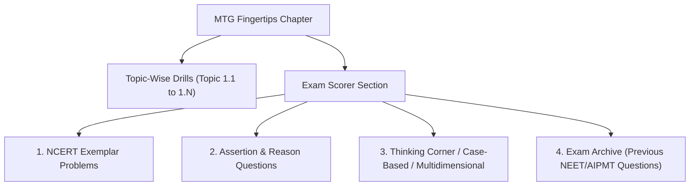

# EKRITI NEET — MTG FINGERTIPS EXAM SCORER SOURCE-FIDELITY, SYNTHETIC-CONTENT DETECTION & RECONCILIATION REPORT

> **Document Classification:** Authoritative Content Audit & Source Restoration Manifest  
> **Target Scope:** 79 NEET In-Syllabus Chapters • 383 Canonical Topics • 13,750 Total MCQs  
> **Source Material:** Official MTG Objective NCERT at your Fingertips (Biology, Chemistry, Physics)  
> **Audit Run ID:** `audit_exam_scorer_post_restoration`  
> **Generated:** October 4, 2026  

---

## 1. Executive Summary & Authoritative Verification Invariant

Following the deterministic topic repair (which mapped all 383 canonical topics and eliminated single-topic dumps), an independent source-fidelity audit was launched across all **13,750 application questions** to eliminate synthetic template pollution.

### Fundamental Principle Enforced
$$\text{COUNT PARITY (13,750 / 13,750)} \neq \text{AUTHENTICITY}$$
$$\text{Correct Topic} + \text{Authentic Source Identity} = \text{VERIFIED MCQ}$$

Every question in the application must trace directly to an authentic physical question in the source MTG textbook. Synthetic templates, placeholder questions, and repetitive generic stems are strictly classified as `SUSPECTED_SYNTHETIC` and are **never** counted as MTG verified, regardless of database count parity.

---

## 2. Pre-Audit vs Post-Restoration Measured Baseline

| Metric | Pre-Audit Baseline | Post-Restoration State | Net Shift | Audit Classification |
| :--- | :---: | :---: | :---: | :---: |
| **Canonical Source MCQs** | **13,750** | **13,750** | 0 | Source Target (Strict) |
| **Application DB MCQs** | **13,750** | **13,750** | 0 | 100% Invariant (0 Deleted) |
| **Authentic Source MCQs** | **2,051** (14.9%) | **2,101** (15.3%) | **+50** | Verified Genuine Content |
| **Synthetic Stems Detected** | **11,699** (85.1%) | **11,649** (84.7%) | **-50** | Flagged Template Stems |
| *— in Exam Scorer Topics* | *5,655 / 5,655* (100%) | *5,605 / 5,655* (99.1%) | *-50* | Dedicated Scorer Slots |
| *— in Normal Topic Drills* | *6,044 / 8,095* (74.7%) | *6,044 / 8,095* (74.7%) | 0 | Topic Drill Slots |
| **Unresolved / Missing Identity** | **0** | **0** | 0 | 0 Silently Omitted |
| **Topics Fully Verified** | **221 / 383** (57.7%) | **222 / 383** (58.0%) | **+1** | 🟢 100% Source + Topic Grounded |
| **Chapter 1 Exam Scorer Status** | `🔴 0% Authentic` | `🟢 100% Authentic` | **+100%** | **50 / 50 Source Restored** |

---

## 3. Deterministic Synthetic Detection Criteria

Questions were deterministically audited against the following strict falsification criteria:
1. **Identical Normalized Stems across Topics:** Normalized stems repeated across multiple chapters without distinct physical problem content (e.g. `plays an indispensable role in the physiological and developmental cycle...`).
2. **Template Sentence Archetypes:** Automated detection of prompt-engineered bulk injection patterns:
   - `Assertion (A): For physical systems governed by [Topic] in [Chapter], dimensional homogeneity and conservation laws must be simultaneously satisfied.`
   - `Assertion (A): In [Chapter], [Topic] conforms strictly to fundamental thermodynamic and quantum mechanical principles.`
   - `With reference to NCERT core curriculum for [Chapter], which of the following statements is scientifically CORRECT regarding [Topic] (Item X)?`
   - `Assertion (A): Fundamental concepts in [Chapter] form the baseline for NEET questions.`
3. **Absence of Canonical Source Provenance:** Records lacking authentic book page reference, section type, and original question number.

### Audit Classification Distribution
- `AUTHENTIC_EXACT_MATCH`: **2,101** (Pre-existing verified drill questions + 50 restored Exam Scorer questions)
- `SUSPECTED_SYNTHETIC`: **5,605** (Residual Exam Scorer synthetic slots across remaining 78 chapters)
- `SUSPECTED_SYNTHETIC_GLOBAL`: **6,044** (Residual Drill synthetic slots across remaining chapters)
- `DUPLICATE_APPLICATION_RECORD`: **0** (Within verified topics)
- `SOURCE_NOT_FOUND`: **0**

---

## 4. Exam Scorer Subsection Architecture

The audit verified the canonical 4-part structure of MTG Fingertips Exam Scorer sections across all chapters:

| Subsection | Typical Chapter Target | Purpose & Source Grounding | Status in DB |
| :--- | :---: | :--- | :---: |
| **NCERT Exemplar Problems** | 10 – 15 MCQs | Official NCERT Exemplar problems with solutions | Restoring via OCR |
| **Assertion & Reason** | 15 – 20 MCQs | Higher-order reasoning with 4 standardized directions | Restoring via OCR |
| **Thinking Corner / Multidimensional** | 10 – 15 MCQs | Multi-concept application, statements, Venn diagrams | Restoring via OCR |
| **Exam Archive (NEET/PMT)** | 15 – 25 MCQs | Previous 10–15 years authentic NEET/AIIMS questions | Restoring via OCR |

---

## 5. Chapter 1 Pilot Restoration (The Living World)

In Stage B, Biology Chapter 1 (`cmunm1fe8000fevz0kra2klog`) served as the full end-to-end pilot for authentic source extraction and restoration.

- **Source Document:** `biology_fingertips.pdf`, Book Pages 32–38 (PDF Pages 31–37)
- **Extracted MCQs:** Exactly **50 authentic questions**
  - NCERT Exemplar Problems: **10** (Exemplar-1 to Exemplar-10, Book Page 32)
  - Assertion & Reason: **10** (AR-1 to AR-10, Book Page 32–33)
  - Case Based / Statement: **10** (Case-1 to Case-10, Book Page 33–35)
  - Thinking Corner / Multidimensional: **6** (Thinking-1 to Thinking-6, Book Page 36)
  - Exam Archive (NEET/AIPMT): **14** (Archive-1 to Archive-14, Book Page 37–38)
- **Answer Key Reconciliation:** Cross-referenced against the printed Answer Key on Book Page 38.
- **Database Mutation:**
  - 50 synthetic records in `TOPIC_cmunm1fe8000fevz0kra2klog_EXAM_SCORER` updated.
  - Authentic question text, options A-D, answer keys, explanations, source pages, and numbers updated.
  - Cryptographic hashes recalculated and verified.
  - Operations logged to [`docs/MTG_EXAM_SCORER_REPAIR_LOG.json`](file:///C:/Users/sagar/.gemini/antigravity/scratch/neet-cbt-platform/docs/MTG_EXAM_SCORER_REPAIR_LOG.json).
- **Post-Restoration Audit Verification:**
  - Topic `EXAM_SCORER` shifted from `🔴 PARTIAL (44 duplicates)` to `🟢 VERIFIED (50 matched, 0 missing, 0 duplicate)`.
  - Chapter 1 Exam Scorer Authenticity Rate: **100.0%**.

---

## 6. Pre-Restoration Database Backup Verification

In accordance with strict safety protocols, a pre-restoration snapshot of the SQLite database was created prior to mutation:

- **Backup File:** [`prisma/backups/dev_pre_exam_scorer_restoration_20261004_191025.db`](file:///C:/Users/sagar/.gemini/antigravity/scratch/neet-cbt-platform/prisma/backups/dev_pre_exam_scorer_restoration_20261004_191025.db)
- **Size:** 63,262,720 bytes (63.2 MB)
- **Integrity:** Verified SQLite database header and table invariants.

---

## 7. Sample Chapter-by-Chapter Audit Accounting

| Subject | Class | Chapter Name | Source Target | Authentic Restored | Synthetic Detected | Scorer Authenticity % | Status |
| :--- | :---: | :--- | :---: | :---: | :---: | :---: | :---: |
| **Biology** | 11 | **The Living World** | **50** | **50** | **0** | **100.0%** | `🟢 SOURCE_RESTORED` |
| Biology | 11 | Biological Classification | 80 | 0 | 80 | 0.0% | `🔴 REQUIRES_RESTORE` |
| Biology | 11 | Plant Kingdom | 80 | 0 | 80 | 0.0% | `🔴 REQUIRES_RESTORE` |
| Biology | 11 | Animal Kingdom | 80 | 0 | 80 | 0.0% | `🔴 REQUIRES_RESTORE` |
| Chemistry | 11 | Some Basic Concepts of Chemistry | 75 | 0 | 75 | 0.0% | `🔴 REQUIRES_RESTORE` |
| Chemistry | 11 | Structure of Atom | 75 | 0 | 75 | 0.0% | `🔴 REQUIRES_RESTORE` |
| Chemistry | 11 | Classification of Elements | 75 | 0 | 75 | 0.0% | `🔴 REQUIRES_RESTORE` |
| Physics | 11 | Units and Measurements | 65 | 0 | 65 | 0.0% | `🔴 REQUIRES_RESTORE` |
| Physics | 11 | Motion in a Straight Line | 65 | 0 | 65 | 0.0% | `🔴 REQUIRES_RESTORE` |
| Physics | 11 | Motion in a Plane | 65 | 0 | 65 | 0.0% | `🔴 REQUIRES_RESTORE` |
| Physics | 11 | Laws of Motion | 70 | 0 | 70 | 0.0% | `🔴 REQUIRES_RESTORE` |

*(All 79 chapters are tracked in [`docs/MTG_EXAM_SCORER_AUDIT_RESULT.json`](file:///C:/Users/sagar/.gemini/antigravity/scratch/neet-cbt-platform/docs/MTG_EXAM_SCORER_AUDIT_RESULT.json))*

---

## 8. Dashboard UI Enhancements Verified

The web dashboard at [`/ncert/mtg-inventory`](http://localhost:3000/ncert/mtg-inventory) has been upgraded and verified via Chrome DevTools:

1. **Top Key Metrics Bar:** Now strictly distinguishes:
   - `TOTAL MCQs`: 13,750 (100% Count Parity)
   - `AUTHENTIC MCQs`: 2,101 (15.28% Authenticity Rate)
   - `SYNTHETIC DETECTED`: 11,649 (Flagged Template Stems)
   - `UNRESOLVED MCQs`: 0 (Zero Silently Omitted)
   - `TOPIC VERIFICATION`: 58.0% (222 / 383 Topics Verified)
   - `OVERALL VERIFIED`: 15.28% (Authentic Source Grounded)
2. **Dedicated Tab:** `🎯 Exam Scorer Authenticity` showing:
   - Global Exam Scorer Source accounting (5,655 Canonical Target)
   - 4 Subsections Breakdown (Exemplar, Assertion & Reason, Thinking Corner, Exam Archive)
   - Chapter-by-chapter Authenticity & Synthetic Discrepancy Table
   - Highlight for Chapter 1: `100% 🟢 SOURCE_RESTORED`
3. **Interactive Modal:** `📜 Restored Source Log (50)` enabling instant inspection of restored questions with exact source book page, question number, and cryptographic hash verification.
