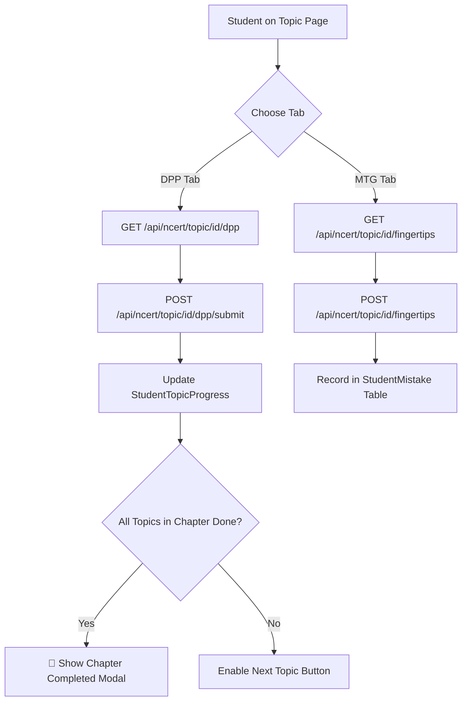

# NCERT Topic Practice Report

## 1. Practice Hierarchy within Each Topic
Every topic in the NCERT reader contains a dual-tier practice framework:
1. **Tier 1: Daily Practice Problems (DPP)**
   - 5 foundational NCERT line-by-line questions.
   - Immediate feedback with solution explanation.
   - Purpose: Ensure student understands the basic text before proceeding.
2. **Tier 2: MTG NCERT at your Fingertips Practice**
   - 5–10 authentic NEET exam-level questions extracted from MTG Fingertips.
   - Higher difficulty, analytical framing, negative marking (+4 / -1) mindset.
   - Integrated into the dedicated `📚 MTG Practice` tab.

## 2. Topic Practice Data Pipeline

## 3. Analytics & Mistake Tracking
- Incorrect selections are logged into the student's personal mistake notebook (`StudentMistake`).
- Each recorded mistake captures:
  - `questionId`
  - `selectedOption` vs `correctOption`
  - `explanation`
  - `conceptId`
- Mistakes feed directly into the spaced repetition flashcards and revision planner.
