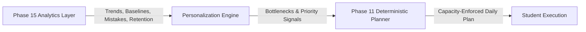

# Evidence-Driven Personalization & Study OS Integration

## 1. Core Integration with Phase 11 Deterministic Planner
Phase 15 acts as the **intelligence and evidence provider** for the platform. It does NOT invent a parallel scheduler or override student calendars directly. Instead, it feeds multidimensional evidence signals into the authoritative **Phase 11 Personal AI Study OS**:

---

## 2. Personalization Signal Vectors
1. **Longitudinal Trends**: Subjects or chapters showing `DECLINING` or `VOLATILE` performance are weighted higher for structured review.
2. **Concept Stability**: Concepts marked `UNSTABLE` or suffering from high `delayedDrop` receive priority remediation tasks before new topics are introduced.
3. **Mistake Clusters**: Recurring error categories (e.g. `CALCULATION` or `SIGN_CONVENTION`) trigger targeted drills with relevant question types.
4. **Execution Baselines**: When a student's actual study minutes consistently fall below planned minutes, the planner automatically adjusts daily session durations to prevent compounding backlogs.

---

## 3. Insight Cards & Student Feedback Loop
Students receive actionable **Insight Cards** on their `/analytics` dashboard:
- Each card states observed evidence, time window, sample size, and a confidence rating (`HIGH`, `MODERATE`, `LOW`).
- Suggested actions are transparently justified (e.g., "Recommended 20 minutes of Kinematics practice because accuracy dropped 18% over the past 14 days").
- Students can rate insights (`HELPFUL` / `NOT_HELPFUL`), stored in `LearningInsightFeedback` without mutating the underlying objective analytics.
