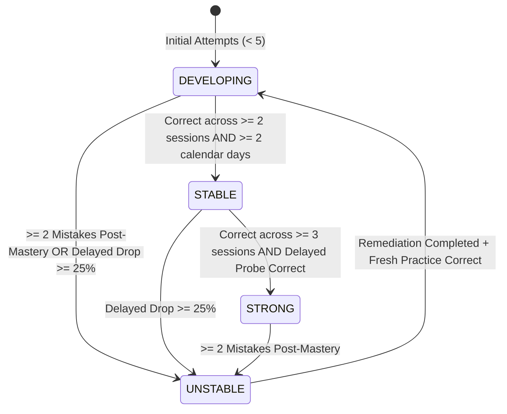

# Concept Stability & Retention Methodology

## 1. Descriptive Retention Framework
Phase 15 strictly measures retention using **descriptive behavioral metrics** rather than asserting unverified biological or neurological memory claims.

### Core Metrics:
1. **Multi-Session Consistency**:
   - `correctAcrossSessions`: Number of distinct calendar days/sessions where the concept was answered correctly.
   - `correctAcrossDays`: Number of unique calendar dates with correct attempts.
2. **Delayed Performance**:
   - Compares performance during initial acquisition (first 48 hours) versus delayed probes ($> 7$ days later).
   - $\text{Delayed Drop} = \max(0, \text{Accuracy}_{\text{initial}} - \text{Accuracy}_{\text{delayed}})$ in percentage points.
3. **Mastery Stability vs. False Fluency**:
   - Tracks `incorrectAfterMastery`: count of mistakes occurring after reaching temporary mastery ($\ge 3$ consecutive correct answers).

---

## 2. Concept Stability State Machine

### State Definitions:
- **`UNSTABLE`**: Exhibits high degradation (>25 percentage point drop after delay or repeated failures after initial mastery). Requires structured remediation.
- **`DEVELOPING`**: Learning in progress; insufficient longitudinal evidence across multiple distinct days.
- **`STABLE`**: Performance replicated across multiple distinct days/sessions with consistent accuracy.
- **`STRONG`**: Demonstrated high retention on delayed probes (>7 days post initial practice) across $\ge 3$ separate sessions.

---

## 3. Storage & Integration
Stability records are stored in `ConceptStabilityProfile` and updated incrementally as new `AttemptEvent` records arrive. They directly drive the **Interactive Learning Map** and feed priority weights into the Phase 11 study planner.
